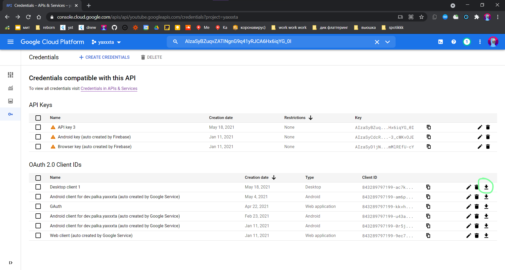
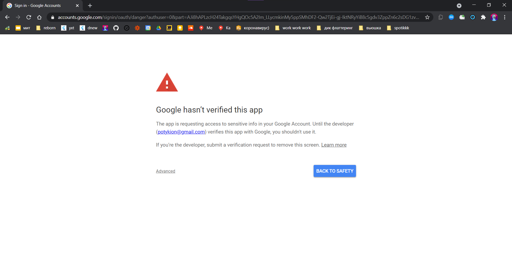

# Рандомайзер Ютуб видосов

Предыстория тут: https://potykion.github.io/dev/ideas#yt-shuffle

Скрипт получает все видики из плейлиста и рандомизирует их прямо в плейлисте

## Детали

- У Youtube Data API есть [квота](https://developers.google.com/youtube/v3/getting-started#quota) в 10к юнитов в день
- 1 запрос `playlistItems/update` стоит 50 юнитов - в день можно ~200 видосов зарандомить


## Сетап

1. Создаем проект в Google Cloud Platform
2. Включаем Youtube Data API в https://console.cloud.google.com/apis/library
3. Переходим в Credentials + создаем OAuth client ID с типом Desktop
4. Качаем client_secret.json

   

5. Закидываем в папку с проектом, создаем `.env`-файл с названием client_secret.json файла:

   ```
   CLIENT_SECRET_JSON=client_secret_843289797199-ac7kigb3b8qv3rmu3eis7rr93dfl0k4u.apps.googleusercontent.com.json
   ```

6. Ставим зависимости: `poetry install`

7. Запускаем скрипт: `python main.py`

8. При запуске будет предожено перейти по гугл-ссылке, там может быть такое:

   

   В таком случаем прожимаем `Advanced > Go to project...`

9. Все принимаем, в конце будет предложено скопировать код, типа `4/1AY0e-g5MsByqd2EJ6fCg...` - его вставляем
   в `Enter the authorization code:` из пункта 7

10. Скрипт должен начать грузить инфу о видиках и рандомизировать их

